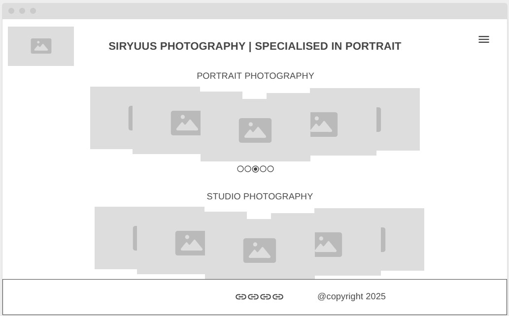
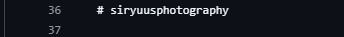

# Siryuus Photography (my photography website)

## Description

This is my personal photography website where I will showcase my work and share my passion for portrait photography. This is aimed for users interested in portrait photography who would like to see my work and get in touch with me for a photoshoot. This will also be a way to share my work with other photographers and potential collaborators.

### Languages and Tools

- HTML
- CSS
- Visual Studio Code
- Git / GitHub

## How to view the project

- [website](https://nicolasvalloriuk.github.io/Siryuus-Photography/)

## User experience Design UXD

### Overview

The website is a Photography portfolio website, Which purpose is to attract new customers and share the work of the photographer.

### 1. Strategy plane

**Target user:**

- Customers:
People who are interested in portrait and fine-art photography, and who are looking for a photographer.
- Potential collaborators:
Other photographers, models, makeup artists, etc.
- The photographer:
As my own portfolio as website, this will be a way to share my work and get in touch with potential clients.

**Primary problem to solve:**
Create a website that is easy to navigate, visually appealing and that showcases the work of the photographer in the best way possible.

**User needs:**

- Easy navigation
- Visually appealing design
- Clear showcase of the photographer's work
- Contact information and form

**Business goals:**

- Showcase the work of the photographer
- Attract new customers
- Encourage potential collaborators

**Value proposition:**
A simple and clear website that showcases the work of the photographer in a visually appealing way, making it easy for potential customers to find the information they need and get in touch with the photographer.

### 2. Scope plane

**MVP (Minimum Viable Product) features:**

- Main page with navigation, carousel and footer
- About me section with contact form
- Gallery portrait with at least 6 pictures
- A footer with copyright information and links to social media

**Future features:**

- Add a gallery for studio photography
- Add a gallery  for fine-art
- Add the carrousel in the main page for studio photography and fine-art photography
- Change the carrousel to be more interactive and dynamic with javascript

**Content requirements:**

- Information about the photographer
- A gallery with at least 6 pictures for the portrait photography
- Contact form with name, email and message fields

### 3. Structure plane

**The website is structure in the following pages:**

- Home page (index.html)
- About me page (about.html)
- Gallery page (gallery.html)

**User flow:**

1. User lands on the home page (index.html)
2. User can navigate to the about me page (about.html) to learn more about the photographer and see the contact form
3. User can navigate to the gallery page (gallery.html) to see the portfolio of the photographer

**Content is grouped locally:**

- The home page will have a carousel with the best pictures of the photographer, and a footer with contact information and links to social media.
- The about me page will have a picture of the photographer and a short description about him, and a contact form with name, email and message fields.
- The gallery page will have a gallery with at least 6 pictures for the portrait photography, and in the future it will have a gallery for studio photography and fine-art photography.

### 4. Skeleton plane

**Layout:**

Home page:

- Navigation bar at the top of the page with links to the different pages
- Key information (name of the photographer, summary of the work, etc.) in the home page
- Carousel with the best pictures of the photographer

About page:

- About me section with a picture and a short description about the photographer
- A contact form, for users to get in touch with the photographer, with name, email, project idea and message fields

Gallery page:

- A gallery with at least 6 pictures for the portrait photography, and customer testimonials.

**Design priorities:**

- Clear and easy navigation
- Visually appealing design that showcases the work of the photographer
- Clear and concise information about the photographer and how to get in touch with him

### 5. Surface plane

**Design choices:**

Color palette:

- Background:
  - header / navigation bar background color: #1a1a1a (dark gray)
  - background color: #0d0d0d (black)
  - footer background color: #1a1a1a (dark gray)
  - box shadow color: #3c3c3c (medium gray)
  - border box color #f5f5f5f (white)

- Text colors:
  - Primary text color: #f5f5f5 (white)
  - secondary text color: #a5a5a5 (gray)
  - Logo original color: Silver (image with transparent background)

- Button colors:
  - Primary button color: #f5f5f5 (white)
  - Secondary button color: #a5a5a5a5 (gray)

- Radio button colors:
  - primary radio button color: #a5a5a5 (gray)
  - selected radio button color: #bbbbbb (light gray)

- Icon colors:
  - primary icon color: #f5f5f5 (white)
  - secondary icon color: #a5a5a5 (gray)

Typography:

- Heading font:
  - font-family: "Playfair Display", "Times New Roman", Times, serif

- Body font:
  - font-family: "Inter", "Helvetica Neue", Helvetica, Arial, sans-serif

- Navigation bar font:
  - font-family: "Inter", "Helvetica Neue", Helvetica, Arial, sans-serif

Layout:

- Header:
  - Logo on the **left** (image of the logo)
  - Navigation on the **right** (Home, About with Contact, Portrait Gallery)

- Body :
  - centered content with simple and clean design, with a lot of white space to make the content stand out.

- Footer:
  - Copyright information on the left
  - Links to social media on the right (Instagram, Facebook, Twitter)

- Body Home page:
  - Carousel with section name on top and a short description of the work of the photographer, and a button to see the gallery

- Portrait Gallery page:
  - A grid layout with at least 6 pictures for the portrait photography, small description below each image.

- About me :
  - Contact form:
    - A form with name, email, project idea and message fields, and a submit button.

**UX considerations:**

- High contrast between text and background for readability
- Consistent design across all pages for a cohesive user experience
- Clear and concise information about the photographer and how to get in touch with him
- Visually appealing design that showcases the work of the photographer in the best way possible
- Easy navigation with a clear structure and hierarchy of information

#### UX Reflections

**What worked well:**

- a
- b
- c

**What could be improved:**

- a
- b
- c

**Future improvements:**

- Carrousel with javascript to make it more interactive and dynamic
- Add a gallery for studio photography
- Add a carousel for studio photography in home page
- Add a gallery for fine-art photography
- Add a carousel for fine-art photography in home page
- Add a gallery for collaborations with other photographers, models, makeup artists, etc.
- Add a carouse for collaborations in home page

## Credits

- for the carousel design i used this tutorial: [Video Link](https://www.youtube.com/watch?v=s1hXF_UFCrU) from [Arashtad github](https://github.com/arashtad)

- Fonts from Google Fonts:
  - [Playfair Display](https://fonts.google.com/specimen/Playfair+Display)
  - [Inter](https://fonts.google.com/specimen/Inter)
  - [Helvetica Neue](https://fonts.google.com/specimen/Helvetica+Neue)
  - [Times New Roman](https://fonts.google.com/specimen/Times+New+Roman)
  - [Icons from Font Awesome](https://fontawesome.com/)

[Import url for css file](https://fonts.googleapis.com/css2?family=Inter:wght@300;400;500&family=Playfair+Display:wght@400;500&display=swap)

## Checklist of commits

This is a guide to know where i am at, and to track the commitments so i can have a clear vision of the project and its progress.

1. first commit
2. fix typos and improve formatting in README.md
3. Entering basic structure with folders and files for the project
4. update the readme
5. readme updated
6. merge branch (I had bug with vscode)
7. Add a checklist to the README.md with the current commits and status of the project.
8. Add the bug list and fixes with screenshots to the README.md file.
9. Add the pictures in respective folders (bugs, credits) and update the README.md also update the README.md file with the new images locations.
10. Add project structure to the README.md file.
11. Add gallery folders inside the assets folder and 2 sub-folders one for portraits and one for studio photography and update the README.md file with the new structure.
12. Add some comments to styles.css file to make it more clear and organized, and update the README.md
13. Add the import style to the index.html file and update the README.md
14. Add colors comment to style.css file and update the README.md
15. Add description to the index.html file and update the README.md file.
16. Add the user experience design section to the README.md file.
17. Add more detail to the UXD in the README.md file.
18. Add the details of UXD to the README.md file.
19. Add a wireframe image to the README.md file.
20. Workspace updated
21. Add the surface plane with detail of design choices and UX considerations to the README.md file.
22. Removed list of ideas for deployment as this are now in the UXD section, and update the README.md file.
23. Create meta tags for search engines
24. Add favicon to the index.html file and update the README.md file.
25. Added basic structure to the index file and update the README.md file.
26. Update source of favicon
27. Fix bug (forgot to add favicon.ico to files)
28. Add color to header, body and footer and push the footer to the bottom of the page with flex-box, and update the README.md file.
29. Add  'Inter' to body styles
30. Create navigation section in the header, and update the README.md file.
31. Add Logo to header and justify content in the navigation to space around, and update the README.md file.
32. Changed language to UK English and update the README.md file.
33. Changed the Logo imaged to a new one, and update the README.md file.
34. Add the navigation as a toggle for mobile devices,change the logo picture (size) and update the README.md file. (this web design is mobile first).
35. Add a media query for table and up (768px and up) to change the navigation to a horizontal one, and update the README.md file.
36. Fixed the bug in navigation for the media query for tablet and up, and update the README.md file.
37. Add a media query for desktop and up (992px and up) and add hover effects to navigation links, and update the README.md file.
38. changed the background color of the header, navigation and footer to a darker gray, and update the README.md file.
39. Change the navigation logo for mobiles to a standard burger menu from Fontawsome, and update the README.md file.
40. Add a footer with links to social media and copyright information with Fontawsome icons, and update the README.md file.

## Bugs list and fixes with screenshots

1- **bug in README.md file** the file had some corrupted text, this was deleted and added the correct text.

This was added when connecting VScode to Github, My professor Len saw a different line of code between line 36 and 38, this was fixed by deleting the corrupted text and adding the correct text.
2- **Bug in index.html file** the link to the favicon was incorrect, this caused the favicon to not appear in the browser, this was fixed by adding the correct path to the favicon in the index.html file.
3-**Bug in navigation on media query for tablet** I forgot to hid the navigation button on the media query for tablet and up, this was fixed by adding a display: none; to the navigation button in the media query for tablet and up.

## Structure of the development of the website

----

- index.html
- assets
  - images
    - bugs
    - credits
    - gallery
      - portrait
      - night
  - css
    - style.css

----
