# Siryuus Photography (my photography website)
Milestone 1 - Code Institute

## Description

This is my personal photography website where I will showcase my work and share my passion for portrait photography. This is aimed for users interested in portrait photography who would like to see my work and get in touch with me for a photoshoot. This will also be a way to share my work with other photographers and potential collaborators.

### Languages and Tools

- HTML
- CSS 
- Visual Studio Code - 
- Git / GitHub - 
- Bootstrap - 
- Google Fonts - [Google Fonts] (https://fonts.google.com/)
- Wireframes - [Whimsical](https://whimsical.com/)
- Image conventor jpg to webp [Freeconventer](https://www.freeconvert.com/)
- Icons from [Font Awesome](https://fontawesome.com/)
- For the Form Validation I used [Formspree.io](https://formspree.io/)

## How to view the project

- [Siryuus Photography](https://nicolasvalloriuk.github.io/siryuusphotography/)

## User experience Design UXD

### Overview

The website is a Photography portfolio website, Which purpose is to attract new customers and share the work of the photographer.

### 1. Strategy plane

**Target user:**

- Customers:
People who are interested in portrait and fine-art photography, and who are looking for a photographer.
- Potential collaborators:
Other photographers, models, makeup artists, etc.
- The photographer:
As my own portfolio as website, this will be a way to share my work and get in touch with potential clients.

**Primary problem to solve:**
Create a website that is easy to navigate, visually appealing and that showcases the work of the photographer in the best way possible.

**User needs:**

- Easy navigation
- Visually appealing design
- Clear showcase of the photographer's work
- Contact information and form

**Business goals:**

- Showcase the work of the photographer
- Attract new customers
- Encourage potential collaborators

**Value proposition:**
A simple and clear website that showcases the work of the photographer in a visually appealing way, making it easy for potential customers to find the information they need and get in touch with the photographer.

### 2. Scope plane

**MVP (Minimum Viable Product) features:**

- Main page with navigation, carousel and footer
- About me section with contact form
- Gallery portrait with at least 6 pictures
- A footer with copyright information and links to social media

**Future features:**

- Add a gallery for studio photography
- Add a gallery  for fine-art
- Add the carrousel in the main page for studio photography and fine-art photography
- Change the carrousel to be more interactive and dynamic with javascript

**Content requirements:**

- Information about the photographer
- A gallery with at least 6 pictures for the portrait photography
- Contact form with name, email and message fields

### 3. Structure plane

**The website is structure in the following pages:**

- Home page (index.html)
- About me page (about.html)
- Gallery page (gallery.html)

**User flow:**

1. User lands on the home page (index.html)
2. User can navigate to the about me page (about.html) to learn more about the photographer and see the contact form
3. User can navigate to the gallery page (gallery.html) to see the portfolio of the photographer

**Content is grouped locally:**

- The home page will have a carousel with the best pictures of the photographer, and a footer with contact information and links to social media.
- The about me page will have a picture of the photographer and a short description about him, and a contact form with name, email and message fields.
- The gallery page will have a gallery with at least 6 pictures for the portrait photography, and in the future it will have a gallery for studio photography and fine-art photography.

### 4. Skeleton plane

**Layout:**

Home page:

- Navigation bar at the top of the page with links to the different pages
- Key information (name of the photographer, summary of the work, etc.) in the home page
- Carousel with the best pictures of the photographer

About page:

- About me section with a picture and a short description about the photographer
- A contact form, for users to get in touch with the photographer, with name, email, project idea and message fields

Gallery page:

- A gallery with at least 6 pictures for the portrait photography, and customer testimonials.

**Design priorities:**

- Clear and easy navigation
- Visually appealing design that showcases the work of the photographer
- Clear and concise information about the photographer and how to get in touch with him
- 
#### Wireframes

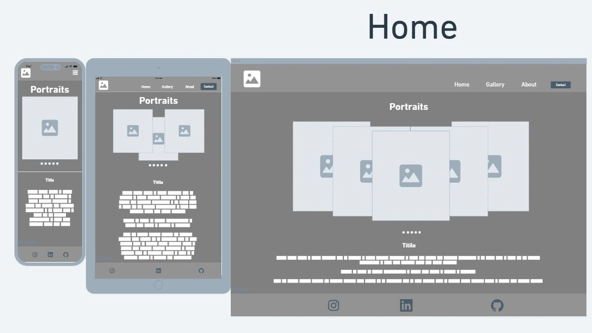
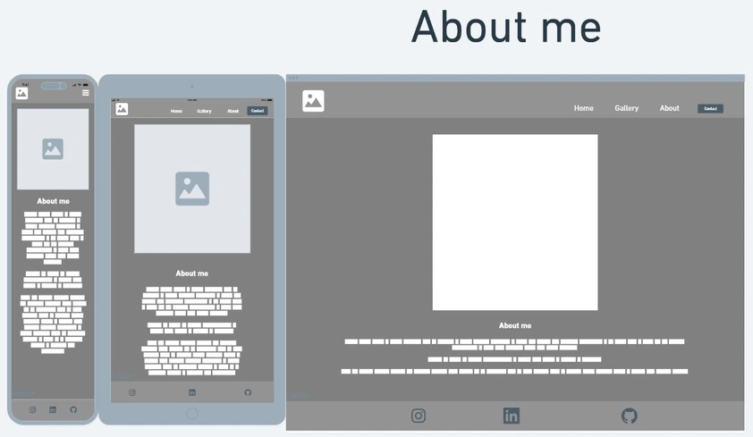
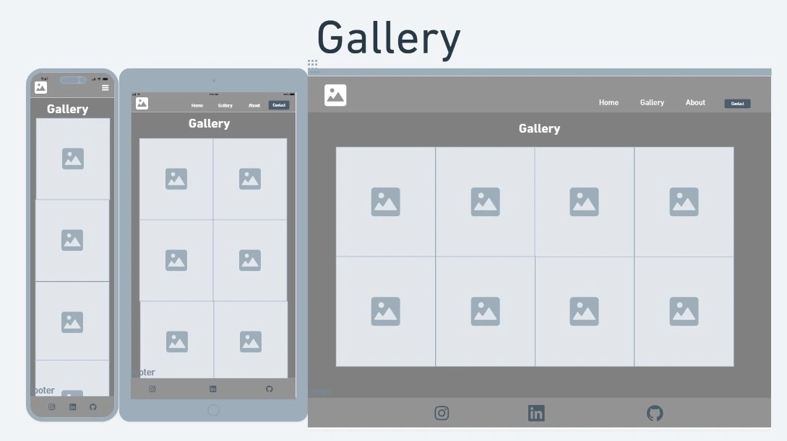

### 5. Surface plane

**Design choices:**

Color palette:

- Background:
  - header / navigation bar background color: #1a1a1a (dark gray)
  - background color: #0d0d0 (black)
  - footer background color: #1a1a1a (dark gray)
  - box shadow color: #3c3c3c (medium gray)
  - border box color #f5f5f5f (white)

- Text colors:
  - Primary text color: #f5f5f5 (white)
  - secondary text color: #a5a5a5 (gray)
  - Logo original color: Silver (image with transparent background)

- Button colors:
  - Primary button color: #f5f5f5 (white)
  - Secondary button color: #a5a5a5a5 (gray)

- Radio button colors:
  - primary radio button color: #a5a5a5 (gray)
  - selected radio button color: #bbbbbb (light gray)

- Icon colors:
  - primary icon color: #f5f5f5 (white)
  - secondary icon color: #a5a5a5 (gray)

Typography:

- Heading font:
  - font-family: "Playfair Display", "Times New Roman", Times, serif

- Body font:
  - font-family: "Inter", "Helvetica Neue", Helvetica, Arial, sans-serif

- Navigation bar font:
  - font-family: "Inter", "Helvetica Neue", Helvetica, Arial, sans-serif

Layout:

- Header:
  - Logo on the **left** (image of the logo)
  - Navigation on the **right** (Home, About with Contact, Portrait Gallery)

- Body :
  - centered content with simple and clean design, with a lot of white space to make the content stand out.

- Footer:
  - Copyright information on the left
  - Links to social media on the right (Instagram, Facebook, Twitter)

- Body Home page:
  - Carousel with section name on top and a short description of the work of the photographer, and a button to see the gallery

- Portrait Gallery page:
  - A grid layout with at least 6 pictures for the portrait photography, small description below each image.

- About me :
  - Contact form:
    - A form with name, email, project idea and message fields, and a submit button.

**UX considerations:**

- High contrast between text and background for readability
- Consistent design across all pages for a cohesive user experience
- Clear and concise information about the photographer and how to get in touch with him
- Visually appealing design that showcases the work of the photographer in the best way possible
- Easy navigation with a clear structure and hierarchy of information

#### Design

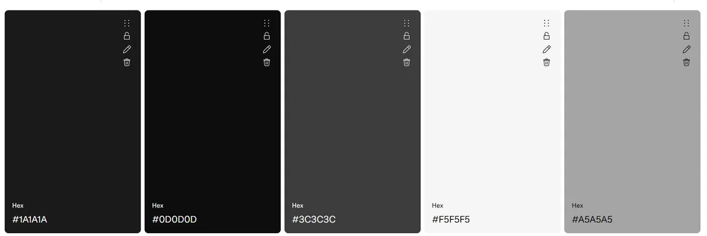
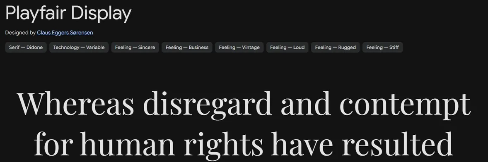
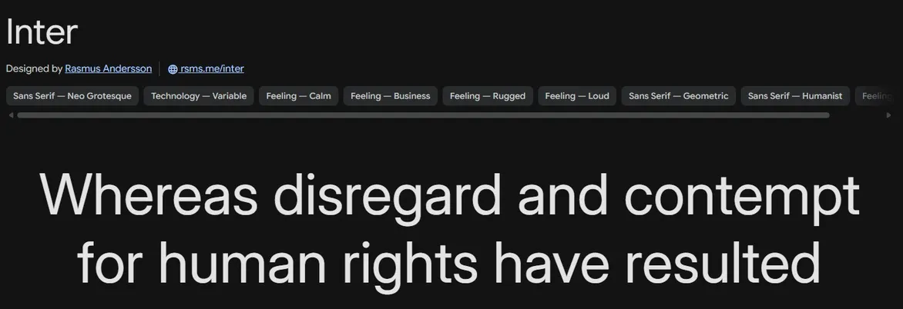

#### UX Reflections

**What worked well:**

**What could be improved:**

**Future improvements:**

- Add a galleries page dedicated to artistic studio photography/events
- Add a carousel in the homepage to have a quick view of this and clickable link to gallery page
- Add a gallery for collaborations with other photographers, models, makeup artists, etc.
- Add a carouse for collaborations in home page

## Users Stories

This has been implemented in GitHub Projects to follow along

### User Story 1

**User Story: Portfolio Showcase** (Must-have)
As a visitor, I want to view a selection of portrait photos so that I can understand the photographer’s style and quality.

**Acceptance Criteria:**

- [x] Users can view a simple gallery of images on the homepage or portfolio page
- [x] Images are displayed in a clean carousel
- [x] The page loads quickly on mobile and desktop

**Tasks:**

- [x] Create responsive image carousel
- [x] Optimise images for web performance
- [x] Build simple portfolio page structure
- [x] Ensure mobile responsiveness

### User Story 2

**User Story: Contact and Booking** (Must-have)
As a potential client, I want to contact the photographer easily so that I can ask questions or request a booking.

**Acceptance Criteria:**

- [x] Users can access a contact form from any page
- [x] Form includes name, email, and message fields
- [x] Submission triggers a confirmation message
- [x] Messages are sent to photographer email inbox
- [x] Form is protected from spam (basic validation or CAPTCHA)

**Tasks:**

- [x] Build contact form UI
- [x] Implement form validation
- [x] Connect form submissions to email delivery
- [x] Add success confirmation message

### User Story 3

**User Story: About the Photographer** (Must-have)
As a visitor, I want to learn about the photographer so that I can trust their experience and style before booking.

**Acceptance Criteria:**

- [x] About section includes a short bio and professional tone
- [x] Includes one portrait or personal image of the photographer
- [x] Content is easy to read and not overly long
- [x] Page is accessible from main navigation
- [x] Loads quickly and is mobile-friendly

**Tasks:**

- [x] Create About page layout
- [x] Insert photographer image
- [x] Link About page in navigation menu
- [x] Ensure responsive design

### User Story 4

**User Story: Client Testimonials** (Could-have) (Future Development)
As a potential client, I want to read testimonials from previous clients so that I can feel confident in the photographer’s quality and professionalism.

**Acceptance Criteria:**

- [ ] Users can view at least 2–5 client testimonials on the site
- [ ] Each testimonial includes a short quote and client name (or business name)
- [ ] Testimonials are displayed in a clean, readable format
- [ ] Section is accessible from the homepage or a dedicated section
- [ ] Content loads quickly and is mobile-friendly

**Tasks:**

- [ ] Design testimonials section layout
- [ ] Add sample testimonial content structure
- [ ] Implement simple text-based display (no complex carousel required)
- [ ] Ensure responsive styling for mobile and desktop
- [ ] Allow easy future updates (e.g., editable content or CMS-ready)

### User Story 5

**User Story: Service Overview** (Could-have) (Future Development)
As a client, I want to see what types of photography services are offered so that I understand what I can book.

**Acceptance Criteria:**

- [ ] Services are listed clearly in simple sections
- [ ] Each service has a short description (1–3 lines)
- [ ] Optional pricing indication or “starting from” info is shown
- [ ] No complex filtering or configuration required
- [ ] Section is easy to scan on mobile

**Tasks:**

- [ ] Design simple services layout
- [ ] Add service descriptions and structure
- [ ] Include optional pricing text
- [ ] Ensure readability and spacing
- [ ] Integrate into homepage or separate page

### User Story 6

**User Story: 404 Page** (should-have)
As any user if i find a broken link, i would like to see a personalised error with a link to be redirected to the homepage.

**Acceptance Criteria:**

- [x]  404 Error Page
- [x]  Personilised to the website
- [x]  Have a button to redirect to Home page
- [x]  Simple information of error page
- [x]  Personalised image

**Tasks:**

- [x] Create a 404.html page
- [x] Design a simple page with the same background and text than the website
- [x] Add a simple and clear description
- [x] Add a button that states go back to home page
- [x] add a personilised image to the page

## Credits 

### Images

- The 404 Page picture was created from CHATGPT with the concept of this website
- The other Pictures in this website are all mine, from my own photographjy company - Siryuus Photography

### Bootstrap

- Navigation Bar was copied from Bootstrap and adjust to my website
- CTA Contact me button was copied from Bootstrap and adjust to my website
- Form was copied from Bootstrap and adjust to my website

### Carousel

- for the carousel design i used this tutorial: [Video Link](https://www.youtube.com/watch?v=s1hXF_UFCrU) from [Arashtad github](https://github.com/arashtad)

## Bugs list and fixes with screenshots

1- **bug in README.md file** the file had some corrupted text, this was deleted and added the correct text.

This was added when connecting VScode to Github, My professor Len saw a different line of code between line 36 and 38, this was fixed by deleting the corrupted text and adding the correct text.
2- **Bug in index.html file** the link to the favicon was incorrect, this caused the favicon to not appear in the browser, this was fixed by adding the correct path to the favicon in the index.html file.
3-**Bug in navigation on media query for tablet** I forgot to hid the navigation button on the media query for tablet and up, this was fixed by adding a display: none; to the navigation button in the media query for tablet and up.

## Testing

### W3C Validators

Testing plan:

- Test each html page
  - index.html
  - about.html
  - gallery.html
  - 404.html

- Test style CSS
  - style.css

- Test User Stories
  - User story 1
  - User story 2
  - User story 3
  - User story 6

- Test Deployed site next to Deployment version
  - Check index.html (each screen size)
  - Check about.html (each screen size)
  - Check gallery.html (each screen size)
  - Check 404.html (each screen size)

#### HTML

- Test index.html
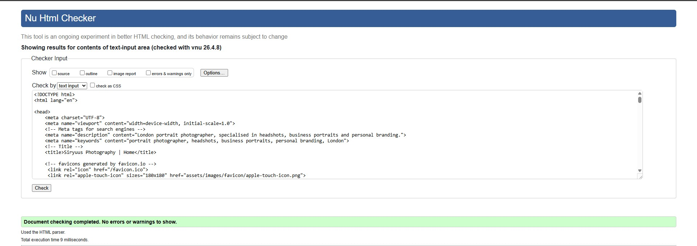
- Test about.html
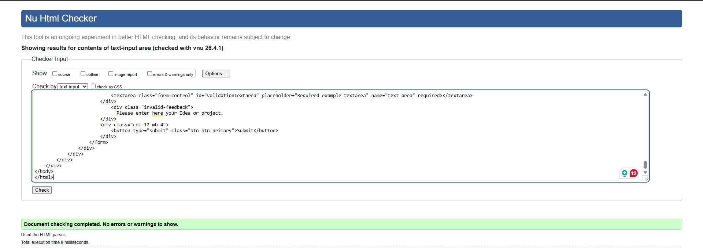
- Test gallery.html
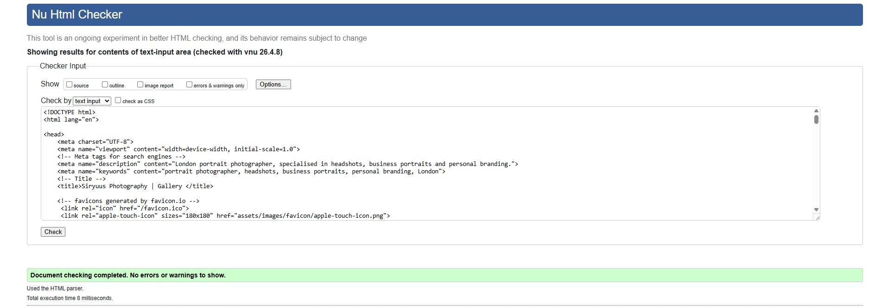
- Test about-html

#### CSS

- Test style.css
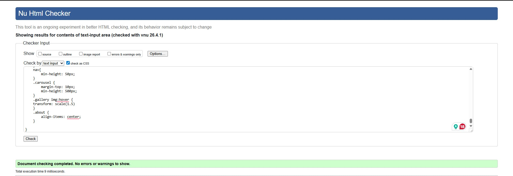 
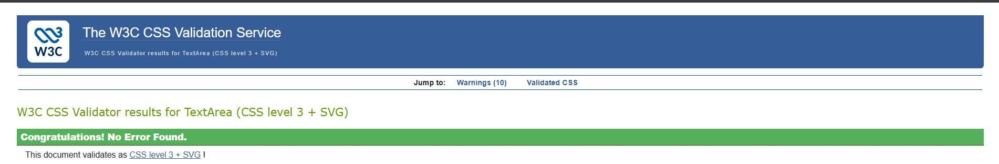 

### User Stories

**User Story: Portfolio Showcase** (Must-have)
As a visitor, I want to view a selection of portrait photos so that I can understand the photographer’s style and quality.

There is a Visible gallery with the portfolio of the client on a gallery page and also in the home page.

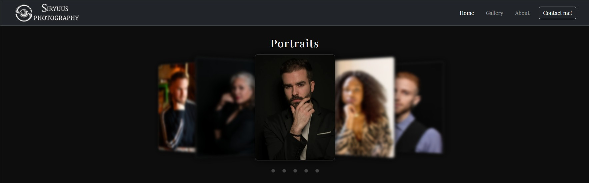
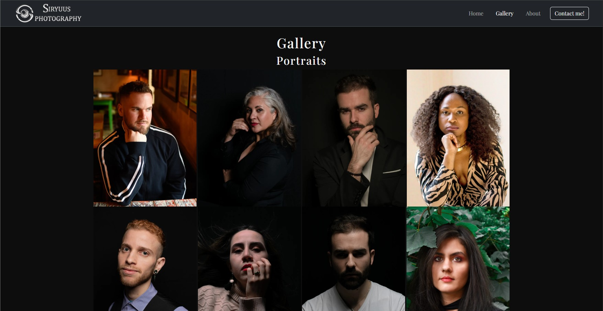

**User Story: Contact and Booking** (Must-have)
As a potential client, I want to contact the photographer easily so that I can ask questions or request a booking.

There is a clear CTA button on the navigation menu, with easy access from every page and device.

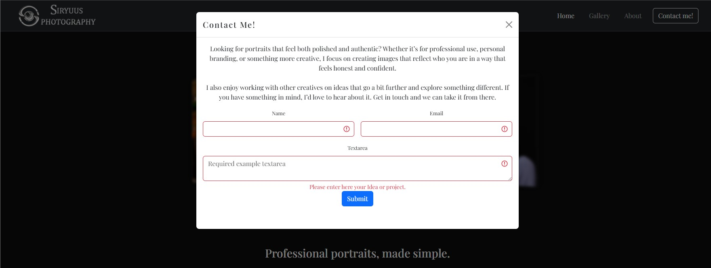

**User Story: About the Photographer** (Must-have)
As a visitor, I want to learn about the photographer so that I can trust their experience and style before booking.

There is a small description on the Home page, and a dedicated page about me.

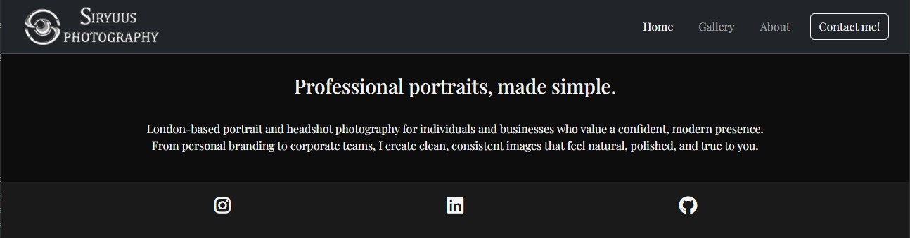
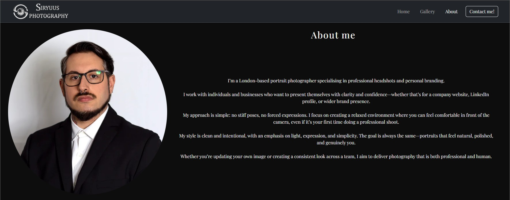

**User Story: 404 Page** (should-have)
As any user if i find a broken link, i would like to see a personalised error with a link to be redirected to the homepage.

There is a simple yet clear page when there is a broken link o page not found

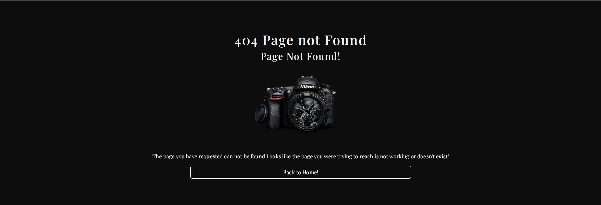

### Deployed vs Deployment testing

The Pictures on the left side are the Deployed site, and the pictures on the right are the Deployment
Index
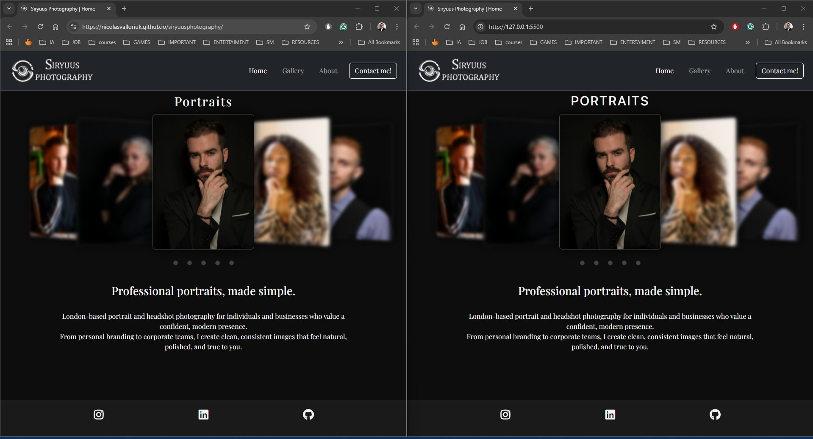

About me
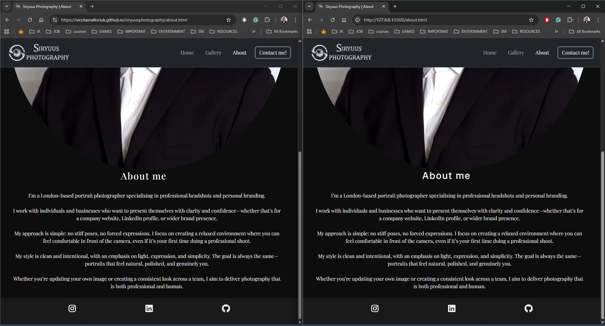

Gallery
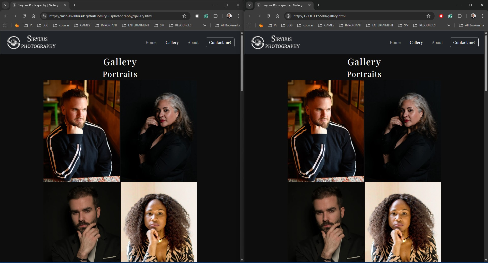

404
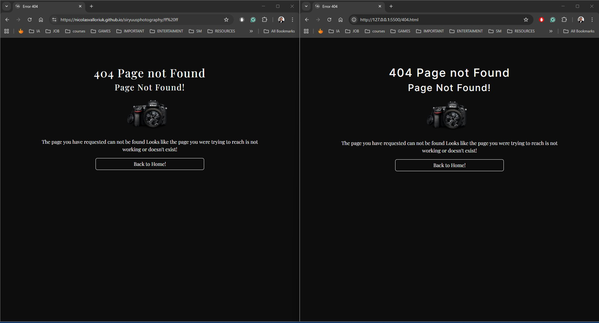
