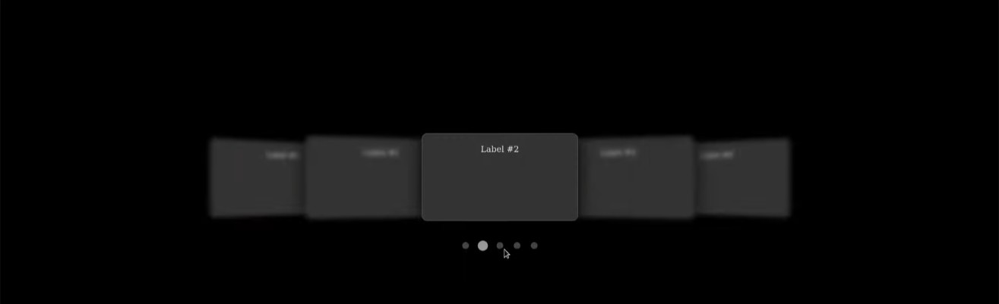

# Siryuus Photography (my photography website)

## Description

This is my personal photography website where I will showcase my work and share my passion for portrait photography and fine-art photography. This is aimed for people who would like to see my work and maybe get in touch with me for a photoshoot.

## Features

1. Main page with:
   1. **Navigation**
   2. **Carousel** (with 3 images each one with a different category of photography and a link to the corresponding gallery)
   3. **Footer** with social media links
2. **About me section** with Contact form
3. **Gallery portrait**
4. **Gallery fine-art**

## Languages and Tools

- HTML
- CSS
- Visual Studio Code
- Git
- GitHub
  
## how to view the project

- [website](https://nicolasvalloriuk.github.io/Siryuus-Photography/)

## credits

- for the carousel design i used this tutorial: [Video Link](https://www.youtube.com/watch?v=s1hXF_UFCrU) from [Arashtad github](https://github.com/arashtad)

### Ideas for development

project | Details of design | Development | Deployed
--- | --- | --- | ---
carousel | 3 pictures with links | . | .
index | main page with navigation | . | .
Portrait Gallery | gallery with at least 6 pictures | . | .
Fine-Art Gallery | gallery with at least 6 pictures | . | .
about me section | section with a picture and a short description about me | . | .
Contact form (maybe together with about me section) | form with name, email and message fields | . | .

### future development ideas

- add javascript to make the website more interactive and dynamic

### checklist of commits

This is a guide to know where i am at, and to track the commitments so i can have a clear vision of the project and its progress.

1. first commit
2. fix typos and improve formatting in README.md
3. Entering basic structure with folders and files for the project
4. update the readme
5. readme updated
6. merge branch (I had bug with vscode)
7. Add a checklist to the README.md with the current commits and status of the project.
